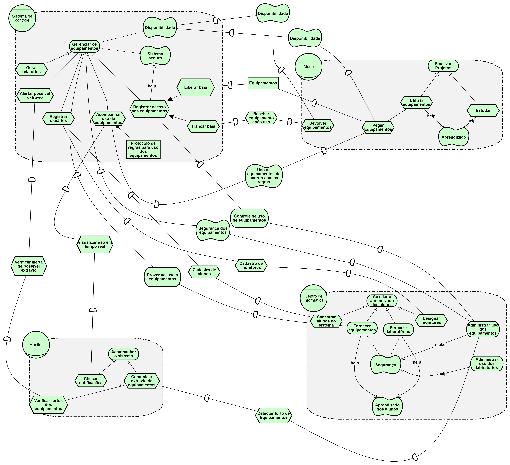
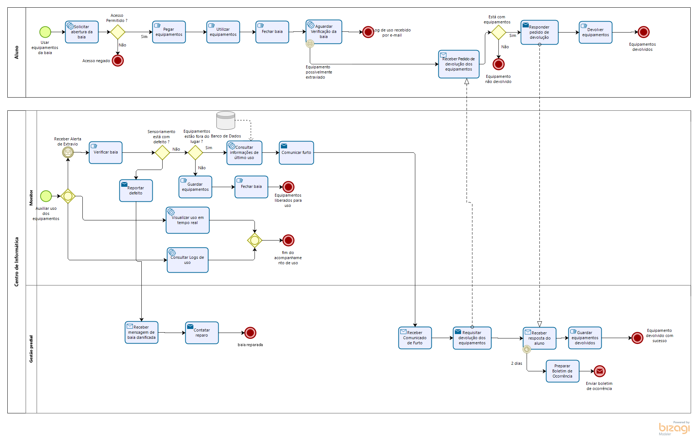

# i* Model
This is repository contains i* models for Requirements engineering discipline at CIn - UFPE (if716).

# Contributing
- Clone this repository
- Open [this tool.](https://www.cin.ufpe.br/~jhcp/pistar/tool/#) It's a web based i* modeling tool.
- On the menu at the top, click **File**, then **Load Model**.
- Choose one of the .txt files on this repository
- Click **Load Model**
- Make changes
- On the menu at the top, click **File**, then **Save Model**. This should download a .txt file.
- Rename the file (**keep .txt extension**), commit it and push it.
- On the menu at the top, click **File**, then **Save Image**.
- Rename the file, commit it and push it.

# Strategic Dependecy AS-IS model

# Strategic Dependency TO-BE model

# Strategic Rationale AS-IS model

# Strategic Rationale TO-BE model

# BPMN AS-IS model

# BPMN TO-BE model

# Non Functional Requirements model

